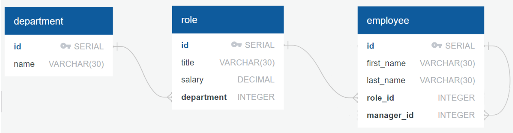
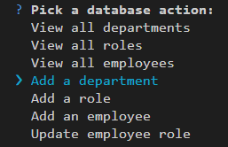
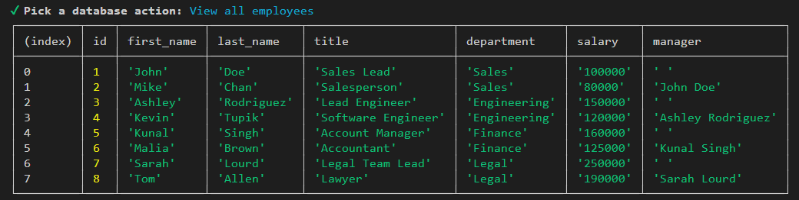
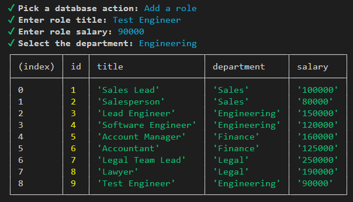
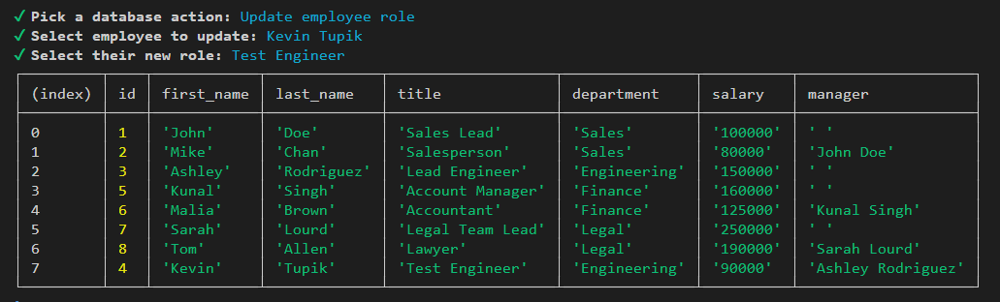

# Employee Tracker
[](https://opensource.org/licenses/ISC)

## Description:
Employee Tracker is a command line application that allows a user to view and manipulate a local PostgreSQL database. The created 'employee_tracker_db' database has the following structure:  


## Table of Contents:
- [Technologies](#technologies)
- [Installation](#installation)
- [Usage](#usage)
- [License](#license)
- [Questions](#questions)

## Technologies:
- JavaScript
- PostgreSQL
- Node.js
- [Inquirer.js](https://www.npmjs.com/package/inquirer)
- [pg](https://www.npmjs.com/package/pg)
- [dotenv](https://www.npmjs.com/package/dotenv)

## Installation:
- Download or clone this repo.

### Database Setup:
- From the repo's root directory, open a psql instance and enter your login credentials:
```
psql -U postgres
```
- Run schema.sql to set up the 'employee_tracker_db' and its tables:
```
\i db/schema.sql
```
- Run seeds.sql to populate 'employee_tracker_db' with starter data:
```
\i db/seeds.sql
```
- Exit the psql instance:
```
\q
```
### Code Setup:
- From the repo's root directory, install the necessary packages with the following command:
```
$ npm i
```
- Create a '.env' file with the following content:
```
DB_NAME=employee_tracker_db
DB_USER=<your user here>
DB_PASSWORD=<your password here>
```
## Usage:
- Watch this demo:  
  
[Demo video - google drive](https://drive.google.com/file/d/1SY2eFp61HkGxVUnDIaQdwOREa-nnFK-X/view?usp=sharing)

- From this repo's root directory, start the application by running the following command:
```
$ node src/index.js
```
- Use the arrow keys to navigate the list of database actions and select one using enter.  

- Selecting any of the viewing options will present a formatted table in the terminal.  

- The add options will ask a series of questions before adding the entry to the database and then showing the newly updated table. For example, adding a role will ask you to supply a title, a salary, and a department selection before adding the entry. Employee additions and department additions are similar.  

- 'Update employee role' updates a pre-existing employee with a specified role. This is done by selecting the employee's name and their new title from existing entries.  

- Select 'Quit' from the list of database actions to exit the program.

## License:
This application is covered under the [ISC](https://opensource.org/licenses/ISC) license.

## Questions:
Contact me via github: [kayla-e774](https://github.com/kayla-e774)  
Or email me at: <kengelstad16@gmail.com>